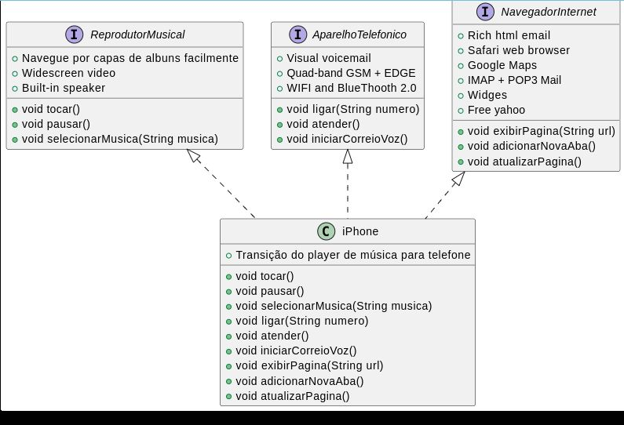

Descrição do POO - Desafio

Chegou a hora de colocarmos em prática toda a concepção de análise de negócios, requisitos, conceitos da programação orientada a objetos e modelagem UML. Com base no vídeo de lançamento do iPhone conforme link abaixo, elabore em uma ferramenta de UML de sua preferência. A diagramação das classes e interfaces com a proposta de representar os papéis do iPhone de: Reprodutor Musical, Aparelho Telefônico e Navegador na Internet. Em seguida crie as classes e interfaces no formato de arquivos .java

Lançamento iPhone 2017

Agora é a sua vez de ser o protagonista! Implemente o desafio sugerido pela expert criando um repositório próprio e, com isso, aumentando ainda mais seu portfólio de projetos no GitHub!

Pré-requisitos:

Lógica de programação e POO;

Conhecimentos básicos(Java);

Computador com SO de sua preferência(Windows, Linux, Mac OS);

IDE (Visual Studio Code, Eclipse, etc);

Submeta seu repositório GitHub conforme as orientações da plataforma DIO. Por exemplo:
https://github.com/glysns/trilha-java-basico/desafios/poo/README.md

Detalhes:
https://github.com/digitalinnovationone/trilha-java-basico/tree/main/desafios/poo


Uso o linux LXQT, com vscode.

Diagramas podem ser feitos no vscode com extensão PlantUML, jebbs. Antes de instalar essa extensão é preciso instalar o Graphviz, o plantUML usa o Graphviz para gerar diagramas. Para instalar o Graphviz, execute:

sudo apt update
sudo apt install graphviz

Insnstalar o PlantUML no VSCode:

No VSCode, Vá para a aba de extensões (Ctrl+Shift+X).
Pesquise por "PlantUML" e instale a extensão desenvolvida por "jebbs".

Configurar a Extensão:

Após instalar a extensão, não é necessário configurar nada adicional. Você está pronto para criar e visualizar diagramas UML.
Criar um Diagrama UML
Criar um Novo Arquivo:

Crie um novo arquivo no VSCode (Ctrl+N).
Salve o arquivo com a extensão .puml ou .plantuml (por exemplo, iphone.puml).


Desafio POO

# Projeto iPhone UML

Este projeto demonstra a modelagem e implementação das funcionalidades principais do iPhone como Reprodutor Musical, Aparelho Telefônico e Navegador na Internet.

## Funcionalidades

- **Reprodutor Musical**:
  - `tocar()`
  - `pausar()`
  - `selecionarMusica(String musica)`

- **Aparelho Telefônico**:
  - `ligar(String numero)`
  - `atender()`
  - `iniciarCorreioVoz()`

- **Navegador na Internet**:
  - `exibirPagina(String url)`
  - `adicionarNovaAba()`
  - `atualizarPagina()`

## Diagrama UML



## Como executar

1. Clone o repositório.
2. Navegue até o diretório do projeto.
3. Compile os arquivos `.java`.
4. Execute a classe `iPhone`.

```bash
javac *.java
java iPhone
